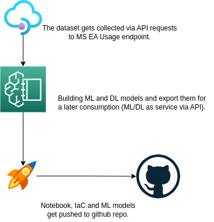
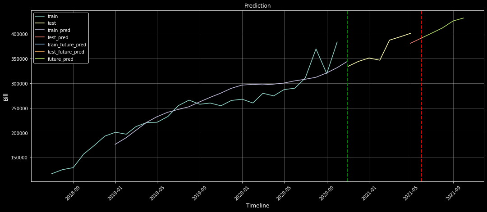

# VICGOV - Azure EA Billing Forecast
## 1. Introduction
### 1.1	Background

Help business to decide in dynamic pricing by identifying business insights and forecasting the trends for future months using time series analysis using LSTM, Tensorflow, Keras, pandas and seaborn saving over $500k per annum.

This document is intended to provide a high level overview of workflow how the LSTM forecast Azure usage cost.

## 2 Logical Architecture
### 2.1	Logical System Component Overview

- The dataset gets collected via API requests to MS EA Usage endpoint.
- Building ML and DL models and export out for a later consumption (ML/DL as service via API).
- Notebook, IaC and ML models get pushed to github repo.

## 3 Forecasat Chart for Visualization

## 4 Azure Bill Forecast using LSTM Neural Networks
- [Full Analysis Notebook](https://github.com/lyoh001/AzureBillForecast/blob/main/notebook/notebook.ipynb)

